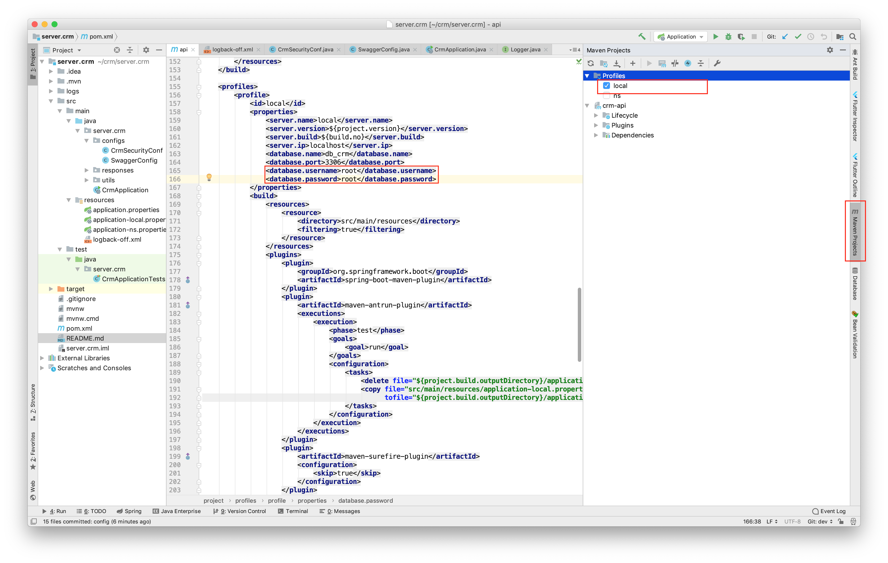

# CRM

### INFORMAITION ABOUT CRM PROJECT (REST API) ###
### `︎YOU MUST READ THIS FILE CAREFULLY BEFORE DO ANYTHING` ###

[→ Development environment](#development-environment-)

[→ Framework](#framework-)

[→ How to deploy application?](#how-to-deploy-application-)

[→  Member in this project](#member-in-this-project-)

[→  Which branch will you develop on?](#which-branch-will-you-develop-on-)

[→  How you can get source?](#how-you-can-get-source-)

[→  Setup source for your local development](#setup-source-for-your-local-development-)

[→  Demo source](#demo-source-)

### Development environment [↑](#crm)

* [JDK 1.8 (Java 8)](https://www.oracle.com/technetwork/pt/java/javase/downloads/jdk8-downloads-2133151.html)
* [IDE: INTELLIJ IDEA 2018](https://www.jetbrains.com/idea/download/#section=mac) (to get licence key for 1 year, sign up with your student gmail, if you can not get it, tell me)
* [MYSQL 5.7](https://dev.mysql.com/downloads/mysql/5.7.html)
* [TOMCAT 8](https://tomcat.apache.org/download-80.cgi)

### Framework [↑](#crm)
* Spring boot framework

### How to deploy application? [↑](#crm)

 `
 I will write it down in the future
 `

### Member in this project [↑](#crm)

**1) Managers:**
* <levinhcntt@gmail.com>
* <phamthanhtung1995@gmail.com>
* <lequanghuygialai@gmail.com>

**2) Developers:**

**Team 1**
* <trungntm.97@gmail.com>
* <vancong33997@gmail.com>

**Team 2**
* <tranngockhoa.spk@gmail.com>
* <hoanghavinguyen@gmail.com>

### Which branch will you develop on? [↑](#crm)
**`→ NOTE: DO NOT CHECKOUT FROM ANOTHER BRANCH WHEN YOU HAVE NO PERMISSION FROM MANAGER ←`**
* **master**: nothing's in here
* **prd**: it's used for releasing production
* **stg**: it's used for testing berfore merging into **prd** and release
* **dev**: it's used for developing, when you finish your functions, it will be merged into **stg** before completed testing  on this branch

**↓from this, all branched will checkout from dev↓**

* **dev_t1**: dev branch for team 1, it wil be merged into **dev** (↓_branch **trung**, **cong** checkout from **dev_t1**↓_)
* **trung**: Trung's branch, it wil be merged into **dev_t1**
* **cong**: Cong's branch, it wil be merged into **dev_t1**

* **dev_t2**: dev branch for team 2, it wil be merged into dev (↓_branch **khoa**, **vi** checkout from **dev_t2**↓_)
* **khoa**: Khoa's branch, it wil be merged into **dev_t2**
* **vi**: Vi's branch, it wil be merged into **dev_t2**

### How you can get source? [↑](#crm)
* Currently, master branch is empty, you need to checkout your assigned branch

**`→ NOTE: CLONE, PUSH, PULL, COMMIT... VIA SSH PROTOCOL ←`**
1) **Work with SSH protocol**:  [→ Guide link's here! ←](https://gitlab.com/help/ssh/README)
* [Create SSH key](https://gitlab.com/help/ssh/README#generating-a-new-ssh-key-pair)
* [Add SSH key to your Gitlab account which you have just created](https://gitlab.com/help/ssh/README#adding-a-ssh-key-to-your-gitlab-account)
2) **Clone your assigned branch**: (Repository will be required entering password for cloning, use password when you setup SSH key)
* Clone Trung's branch `git clone -b trung git@gitlab.com:tungpham6195/server.crm.git`
* Clone Cong's branch `git clone -b cong git@gitlab.com:tungpham6195/server.crm.git`
* Clone Khoa's branch`git clone -b khoa git@gitlab.com:tungpham6195/server.crm.git`
* Clone Vi's branch `git clone -b vi git@gitlab.com:tungpham6195/server.crm.git`

### Setup source for your local development [↑](#crm)
* Currently, profile config for running is default, you need to change if your local does not match
    You need to change your username and password in pom.xml file with your mysql user

* Run application with **local** profile (your local development) in IntelliJ

    This picture show you how to setup

    

### Demo source [↑](#crm)

→ [Driver link](https://drive.google.com/open?id=1_rCN3RGdwwq9XlCIHSdMo-2pW8Jta3ZK) ←
